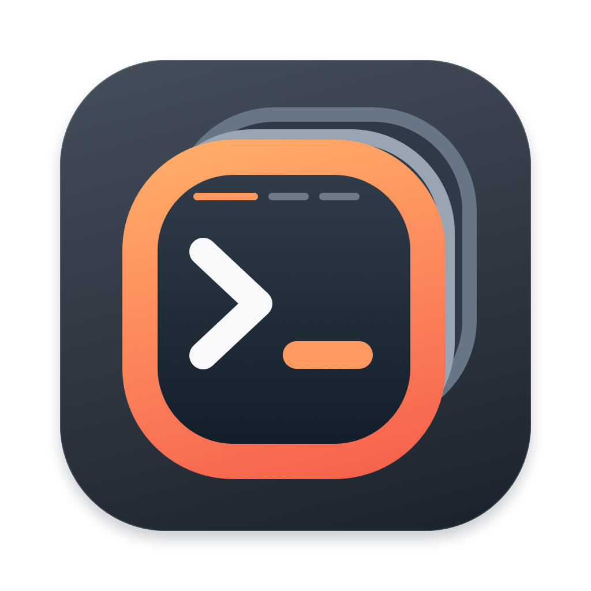

# OShell



原生 macOS SSH 客户端，使用 Swift、AppKit 和 SwiftTerm 构建。支持多会话管理、可拖动分屏和文件传输，不依赖浏览器运行时。

## 功能

- **会话管理**：目录分类、搜索、多选连接、复制、导入导出和顶部快捷链接。
- **终端布局**：多标签、拖动标签分组、嵌套分屏及水平、垂直、瓷砖排列。
- **SSH 连接**：密码、私钥、SSH Agent、跳板机、代理、端口转发和保持活动设置。
- **日常操作**：快速命令、批量发送、同步输入、终端搜索和多行粘贴预览。
- **文件传输**：SFTP、FTP、SCP，以及 rz/sz 上传下载和传输进度。
- **外观**：界面主题、终端配色、关键字和正则突出显示。
- **密码保护**：可选主密码保护与本机 Touch ID 快捷解锁，或无需主密码的本机加密保存。
- **更新**：可配置 GitHub Releases 更新源，下载和安装前验证签名。

## 系统要求与安装

| 构建 | 运行系统 | 架构 |
| --- | --- | --- |
| 现代版 | macOS 13 或更新版本 | Apple Silicon arm64 / Intel x86_64 |
| 通用兼容版 | macOS 11 或更新版本 | Universal（arm64 + x86_64） |
| Intel 兼容版 | macOS 10.13 或更新版本 | Intel x86_64 |

macOS 10.13 / 11 是兼容构建目标，仍需真实旧系统上的进一步验证。具体安装包、签名和公证状态以对应 Release 说明为准。

从项目的 Releases 页面选择适合架构的 PKG 或 DMG。PKG 安装到 `/Applications`；DMG 可将应用拖入 Applications。升级前退出应用，再覆盖安装。没有已发布安装包时，可以从源码构建。

## 从源码构建

需要现代 macOS、Swift 6 工具链和 Xcode Command Line Tools。终端组件、更新框架和传输辅助程序的固定版本依赖位于 `Vendor/`。

```sh
bash scripts/build.sh
open dist/OShell.app
```

构建无需访问维护者的签名私钥，也无需使用真实服务器或会话配置。发布签名、跨架构构建和测试步骤见下方文档。

## 文档

- [使用指南](docs/usage.md)
- [SecureCRT / Xshell 会话导入教程](docs/session-import.md)
- [其他终端会话转换指南（借助 AI 开发脚本）](docs/session-conversion.md)
- [Shell 集成](shell-integration/README.md)
- [开发与测试](docs/development.md)
- [构建与发布更新](docs/releases.md)
- [安全说明](SECURITY.md)
- [贡献指南](CONTRIBUTING.md)
- [变更日志](CHANGELOG.md)

## 许可证

OShell 原创代码及项目资源采用 [GNU GPL 第 3 版](LICENSE)（`GPL-3.0-only`），不提供任何担保。第三方组件保留各自的版权和许可条款，见 [第三方声明](THIRD_PARTY_NOTICES.txt)。
